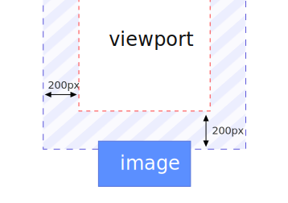

# Custom element &lt;progressive-img&gt;

Custom element (written in Polymer) to load img progressively
and lazily. It first shows tiny blurred placeholder and
loads full-sized image afterwards. It can also defer loading
until placeholder is clicked or enters viewport.

## [Demo](demo/index.html)


## Basic usage

You basically take all your &lt;img&gt; tags, change them to
&lt;progressive-img&gt; and add placeholder attribute. It will
display a blurred placeholder and load src/srcset after being clicked.

```html
<progressive-img
    src="..."
    srcset="..."
    sizes="..."
    alt="..."
    placeholder="my-placeholder.jpg">
</progressive-img>
```

## Load strategy

```html
<progressive-img
    srcset="..."
    placeholder="..."
    alt="..."
    load-strategy="instant | on-visible">
</progressive-img>
```

Load strategy controls when image starts loading.
There are 3 options:

| Load strategy   | Behavior |
| --------------- | -------- | 
| instant         | image will start loading immediately   |
| on-visible      | image will load if is visible or when enters viewport |

Clicking the placeholder will always trigger image loading
no matter what. You can completely leave out load-strategy
if that's all you need.


## Intersection margin

```html
<progressive-img
    srcset="..."
    placeholder="..."
    alt="..."
    load-strategy="on-visible"
    intersection-margin="500px">
</progressive-img>
```

Intersection margin only takes effect if `load-strategy="on-visible"`
is set. Default value is **200px**, so image will trigger loading
when enters 200px wide area around viewport.



For this effect, progressive-img uses intersectionObserver API.
Here you can read more about how it works:
- [Google dev docs](https://developers.google.com/web/updates/2016/04/intersectionobserver)
- [Arnelle Balane's medium blog post](https://blog.arnellebalane.com/the-intersection-observer-api-d441be0b088d)
- [Mozilla docs](https://developer.mozilla.org/en-US/docs/Web/API/Intersection_Observer_API)

intersection-margin attribute is assigned to rootMargin
of intersection observer, so you can use any
[valid value of rootMargin](https://w3c.github.io/IntersectionObserver/#dom-intersectionobserverinit-rootmargin).


## IntersectionObserver Polyfill
If you need to use `load-strategy=on-visible` in [browsers that don't currently
support intersection API](https://caniuse.com/#feat=intersectionobserver),
you can just include official polyfill: https://github.com/w3c/IntersectionObserver/tree/master/polyfill,
it's one liner.


## What about browsers with disabled javascript?
Without js, progressive-img can't load. Which is great
because you can easily create fallback:

```html
<progressive-img src="..." alt="..." placeholder="..."></progressive-img>
<noscript>
  
</noscript>
```

## Styling
progressive-img uses 4 CSS custom properties to customize the appearance.

| CSS property    | description |
| --------------- | ----------- | 
| --placeholder-filter  | Filter applied to placeholder image. Defaults to `blur(10px) saturate(1.2)` |
| --placeholder-scale   | Transform scale value. Defaults to `1.1` to prevent blurred placeholder from having white borders |
| --transition-duration | Duration of swapping placeholder and final image. Defaults to `.2s`  |
| --transition-timing-function | Timing function of swapping placeholder and final image. Defaults to `ease-in` |

You can find examples of this in [demo page](demo/index.html)
